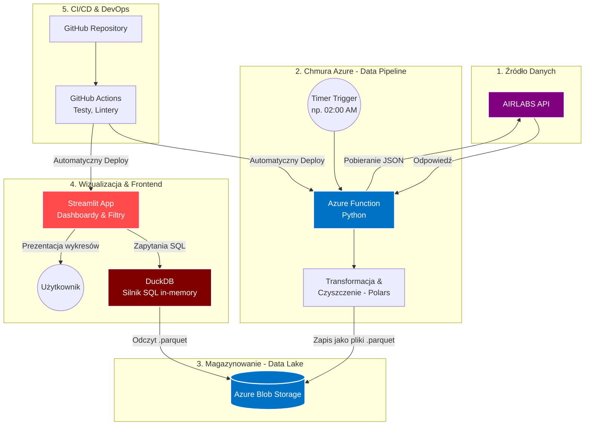

## Szybki Start (Uruchomienie Lokalne)

### 1. Wymagania wstępne
* Zainstalowany [Python 3.13+](https://www.python.org/downloads/)
* Zainstalowane narzędzie **uv**. Jeśli go nie masz, uruchom:
  * Mac/Linux: `curl -LsSf https://astral.sh/uv/install.sh | sh`
  * Windows: `powershell -c "irm https://astral.sh/uv/install.ps1 | iex"`

### 2. Instalacja
Sklonuj repozytorium i zainstaluj wszystkie pakiety jedną komendą:

```bash
git clone [https://github.com/Samekmat/AeroLake.git](https://github.com/Samekmat/AeroLake.git)
cd AeroLake

# uv automatycznie stworzy środowisko .venv i pobierze pakiety z uv.lock
uv sync
```

### 3. Zmienne środowiskowe
Skopiuj plik z przykładowymi zmiennymi i uzupełnij swoje dane uwierzytelniające (klucz do AIRLABS API oraz connection string do Azure Blob Storage):

```bash
cp .env.example .env
```
*(Edytuj plik `.env`).*

### 4. Uruchamianie aplikacji Streamlit (Frontend)
Aby odpalić dashboard analityczny lokalnie:

```bash
uv run streamlit run streamlit_app.py
```
Aplikacja będzie dostępna w przeglądarce pod adresem: `http://localhost:8501`

### 5. Uruchamianie Azure Function (Data Pipeline)
*(Wymaga zainstalowanego [Azure Functions Core Tools](https://learn.microsoft.com/en-us/azure/azure-functions/functions-run-local))*

Uruchom bezpośrednio w głównym katalogu projektu:

```bash
func start
```

## Narzędzia i Jakość Kodu

W projekcie używamy `ruff` do lintowania i formatowania kodu oraz `pre-commit` do automatyzacji tych procesów.

### Instalacja Pre-commit

Po zainstalowaniu zależności (`uv sync`), aktywuj pre-commit w swoim lokalnym repozytorium:

```bash
uv run pre-commit install
```

Od teraz `ruff` będzie automatycznie sprawdzał i formatował Twój kod przed każdym commitem.

### Ręczne Uruchamianie Narzędzi

Jeśli chcesz ręcznie uruchomić linter lub formater na całym projekcie:

```bash
# Sprawdzenie błędów i stylu kodu
uv run ruff check .

# Automatyczne formatowanie plików
uv run ruff format .
```

## Struktura projektu

```text
AeroLake/
├── .github/                     # Konfiguracja CI/CD (GitHub Actions)
│   └── workflows/
│       └── ci.yml               # Walidacja testów i jakości kodu przy Pull Requestach
├── .streamlit/                  # Konfiguracja wyglądu i zachowania Streamlit
│   └── config.toml              # Plik konfiguracyjny Streamlit (porty, motyw itp.)
├── data_pipeline/               # Pobieranie surowych danych(Bronze) oraz przetwarzanie danych Silver i Gold
│   ├── api_client.py            # Klient HTTP dla zewnętrznych API (np. AirLabs)
│   ├── azure_io.py              # Operacje odczytu/zapisu na Azure Blob Storage
│   ├── polars_helpers.py        # Narzędzia pomocnicze Polars (np. dopasowanie schematów)
│   ├── transformers.py          # Logika czyszczenia danych (schedules, flights, weather)
│   ├── ingest_airlabs.py        # Funkcje pobierania rozkładów lotów oraz lotów na żywo
│   ├── ingest_weather.py        # Funkcje pobierania obserwacji pogodowych (OpenWeatherMap)
│   ├── data_processor.py        # Koordynator przetwarzania warstwy Silver
│   ├── gold_processor.py        # Koordynator obliczania i łączenia danych w warstwie Gold
├── frontend/                    # Warstwa wizualizacji i interfejsu (Streamlit)
│   ├── app.py                   # Główny interfejs dashboardu i nawigacja
│   ├── components/              # Komponenty analityczne i prezentacyjne
│   │   ├── analytics.py         # Wykresy trendów, opóźnień i wskaźników KPI
│   │   ├── flights.py           # Tabela lotów na żywo, statusy oraz opóźnienia
│   │   └── map_view.py          # Mapa lotów na bazie biblioteki Leaflet z trasami
│   ├── styles/                  # Style CSS i szablony JS
│   │   ├── map.css              # Customowe style dla mapy lotów
│   │   ├── sidebar.css          # Style paska bocznego ustawień
│   │   └── flight_time_slider.js.j2 # Skrypt JS do osi czasu lotów
│   ├── data_loader.py           # Zapytania SQL przez DuckDB do Azure Blob Storage
│   └── _path.py                 # Pomocnik rozwiązywania ścieżek importu w Streamlit
├── core/                        # Współdzielone definicje i ustawienia systemowe
│   ├── config.py                # Definicje, walidacja i ładowanie zmiennych środowiskowych
│   └── models.py                # Kontrakty danych i modele Pydantic
├── tests/                       # Testy automatyczne (Pytest)
│   ├── test_api_client.py       # Testy mockowania API AirLabs
│   ├── test_data_processor.py   # Testy transformacji danych warstwy Silver
│   ├── test_frontend.py         # Testy ładowania danych w panelu Streamlit
│   └── test_gold_processor.py   # Testy agregacji analitycznych w warstwie Gold
├── .env.example                 # Szablon konfiguracji zmiennych środowiskowych
├── .gitignore                   # Konfiguracja ignorowania plików w repozytorium Git
├── .funcignore                  # Filtry wykluczeń plików podczas deployu do Azure
├── .python-version              # Specyfikacja wersji języka Python (np. 3.13)
├── function_app.py              # Główny punkt startowy wyzwalaczy Azure Functions v2
├── host.json                    # Konfiguracja środowiska uruchomieniowego Azure Functions
├── local.settings.json          # Zmienne środowiskowe lokalnego runtime Azure Functions
├── pyproject.toml               # Metadane projektu, zależności oraz konfiguracja Ruff
├── streamlit_app.py             # Pomocniczy launcher aplikacji Streamlit w głównym katalogu
├── uv.lock                      # Precyzyjne wersje pakietów i zależności projektu
└── README.md                    # Dokumentacja główna projektu
```

## Workflow



## Prezentacja Aplikacji

Oto krótkie nagrania prezentujące funkcjonalności naszej aplikacji analitycznej:

### Analytics
[Obejrzyj nagranie: Analytics](https://github.com/Samekmat/AeroLake/blob/main/docs/videos/analitics.mov)

### Flights Archive
[Obejrzyj nagranie: Flights Archive](https://github.com/Samekmat/AeroLake/blob/main/docs/videos/flights_archive.mov)

### Flights Today
[Obejrzyj nagranie: Flights Today](https://github.com/Samekmat/AeroLake/blob/main/docs/videos/fligts_today.mov)

### Map
[Obejrzyj nagranie: Map](https://github.com/Samekmat/AeroLake/blob/main/docs/videos/map.mov)
