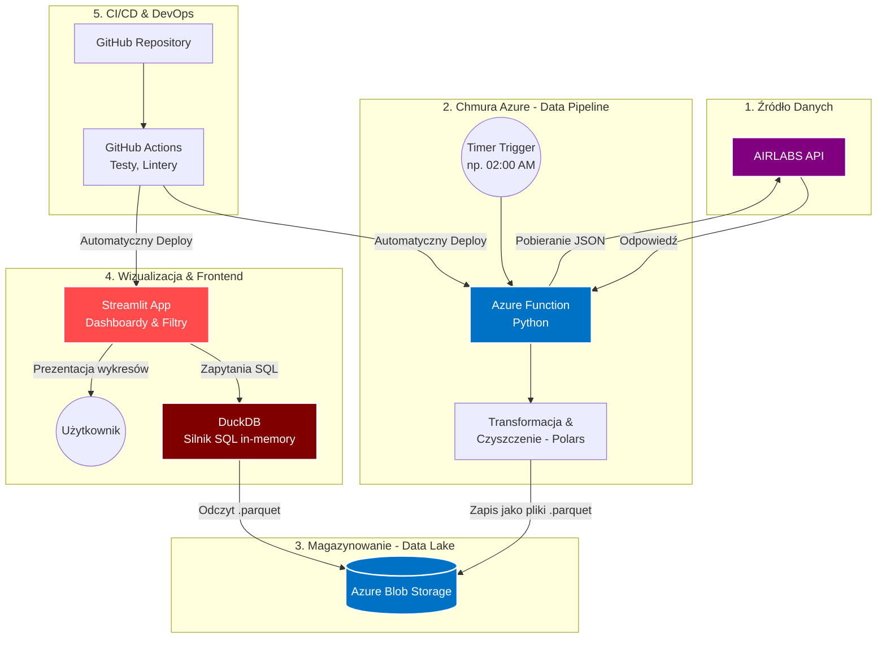

## Szybki Start (Uruchomienie Lokalne)

### 1. Wymagania wstępne
* Zainstalowany [Python 3.13+](https://www.python.org/downloads/)
* Zainstalowane narzędzie **uv**. Jeśli go nie masz, uruchom:
  * Mac/Linux: `curl -LsSf https://astral.sh/uv/install.sh | sh`
  * Windows: `powershell -c "irm https://astral.sh/uv/install.ps1 | iex"`

### 2. Instalacja
Sklonuj repozytorium i zainstaluj wszystkie pakiety jedną komendą:

```bash
git clone [https://github.com/Samekmat/AeroLake.git](https://github.com/Samekmat/AeroLake.git)
cd AeroLake

# uv automatycznie stworzy środowisko .venv i pobierze pakiety z uv.lock
uv sync
```

### 3. Zmienne środowiskowe
Skopiuj plik z przykładowymi zmiennymi i uzupełnij swoje dane uwierzytelniające (klucz do AIRLABS API oraz connection string do Azure Blob Storage):

```bash
cp .env.example .env
```
*(Edytuj plik `.env`).*

### 4. Uruchamianie aplikacji Streamlit (Frontend)
Aby odpalić dashboard analityczny lokalnie:

```bash
uv run streamlit run frontend/app.py
```
Aplikacja będzie dostępna w przeglądarce pod adresem: `http://localhost:8501`

### 5. Uruchamianie Azure Function (Data Pipeline)
*(Wymaga zainstalowanego [Azure Functions Core Tools](https://learn.microsoft.com/en-us/azure/azure-functions/functions-run-local))*

Uruchom bezpośrednio w głównym katalogu projektu:

```bash
func start
```

## Narzędzia i Jakość Kodu

W projekcie używamy `ruff` do lintowania i formatowania kodu oraz `pre-commit` do automatyzacji tych procesów.

### Instalacja Pre-commit

Po zainstalowaniu zależności (`uv sync`), aktywuj pre-commit w swoim lokalnym repozytorium:

```bash
uv run pre-commit install
```

Od teraz `ruff` będzie automatycznie sprawdzał i formatował Twój kod przed każdym commitem.

### Ręczne Uruchamianie Narzędzi

Jeśli chcesz ręcznie uruchomić linter lub formater na całym projekcie:

```bash
# Sprawdzenie błędów i stylu kodu
uv run ruff check .

# Automatyczne formatowanie plików
uv run ruff format .
```

## Struktura projektu

```text
AeroLake/
├── data_pipeline/               # Logika przetwarzania danych Silver
│   ├── azure_io.py              # Operacje wejścia-wyjścia na Azure Blob Storage
│   ├── polars_helpers.py        # Helpery wyrównywania schematów Polars
│   ├── transformers.py          # Logika czyszczenia schedules, flights, weather
│   ├── api_client.py            # Klient HTTP dla AIRLABS API
│   ├── data_processor.py        # Główny koordynator/orchestrator pipeline'u
│   └── data/                    # Lokalna kopia czystych Parquetów (zignorowana w Git)
├── frontend/                    # Warstwa Wizualizacji (Streamlit)
│   ├── app.py                   # Główny plik aplikacji i interfejs UI
│   ├── components/              # Komponenty wielokrotnego użytku (wykresy, tabele)
│   └── data_loader.py           # Integracja z DuckDB do odczytu z Azure Blob Storage
├── core/                        # Współdzielona logika dla całego systemu
│   ├── config.py                # Walidacja zmiennych środowiskowych
│   └── models.py                # Kontrakty danych i modele Pydantic
├── tests/                       # Testy automatyczne (Pytest)
│   ├── test_api_client.py       # Testy API (z użyciem mockowania)
│   ├── test_data_processor.py   # Testy transformacji danych
│   └── test_frontend.py         # Testy wczytywania i widoków
├── .env.example                 # Szablon wymaganych zmiennych środowiskowych
├── .gitignore                   # Pliki ignorowane przez system kontroli wersji
├── .funcignore                  # Wykluczenia plików przed deployem na Azure
├── .python-version              # Deklaracja wersji Pythona dla narzędzia uv (np. 3.13)
├── function_app.py              # Główny punkt wejścia dla Azure Functions
├── host.json                    # Konfiguracja runtime Azure Functions
├── local.settings.json          # Lokalne zmienne środowiskowe dla Azure Functions (ignorowane)
├── pyproject.toml               # Główna konfiguracja projektu, zależności i linterów (Ruff)
├── uv.lock                      # Plik lockujący precyzyjne wersje pakietów (dla powtarzalności)
└── README.md                    # Dokumentacja główna projektu
```

## Workflow


